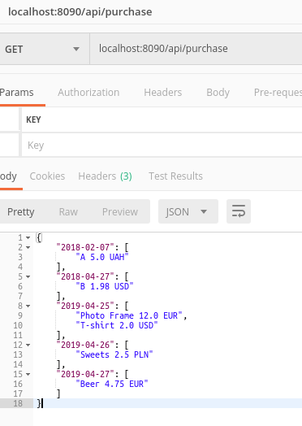
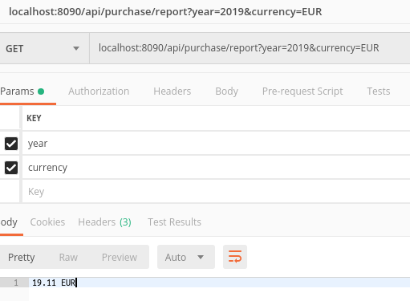
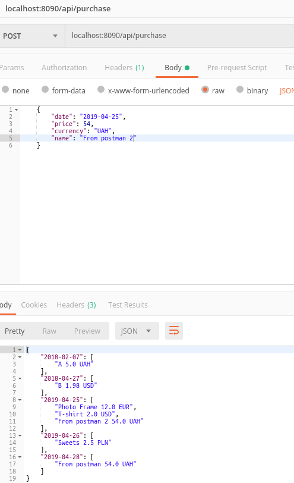
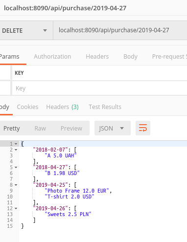

# Intelliarts test task

It's test task for Intelliarts Summer Camp 2019

## What we needs?

* [Java 8](https://www.oracle.com/technetwork/java/javaee/downloads/jdk8-downloads-2133151.html)
* [Maven](https://maven.apache.org/download.cgi)
* [Postman](https://www.getpostman.com/downloads/)

## How run?
 ```git clone https://github.com/stepanLys/intelliarts.git```
 
 ```cd intelliarts```
 
 ```mvn spring-boot:run``` or using [IntelliJ IDEA](https://www.jetbrains.com/idea/download/)

## API

GET requests:
* localhost:8090/api/purchase - returns all purchase
  
* localhost:8090/api/purchase - returns the sum of purchases of specified year in the specified currency
  
  
POST request:
* localhost:8090/api/purchase - returns all purchase after adding
  
  
DELETE request:
* localhost:8090/api/purchase/2019-04-27 - returns all purchases after deletion for a specific date
  
